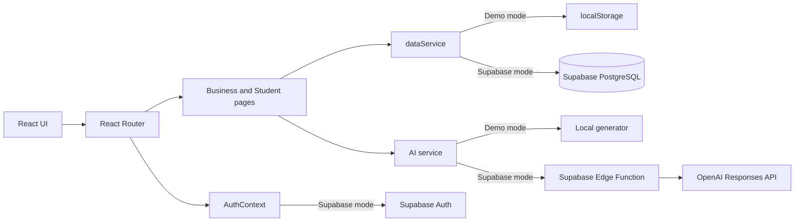

# CaseUp

**CaseUp** — веб-платформа для превращения бизнес-потребности в качественно оформленную практическую задачу и открытого выбора студенческой команды.

Проект создан для кейса AI Sana «Единый кейс по геймификации практических заданий». Представитель бизнеса публикует задачу, студенты самостоятельно выбирают подходящие задачи и отправляют предложения, а бизнес вручную определяет команду для дальнейшей работы.

## Проблема и решение

Бизнесу часто сложно сформулировать задачу достаточно конкретно, чтобы студенческая команда могла оценить ее объем и предложить реалистичное решение. Студентам, в свою очередь, нужен понятный каталог реальных задач с прозрачными требованиями.

CaseUp решает эту проблему с помощью:

- пошагового конструктора бизнес-задачи;
- AI-помощника для преобразования исходного описания в структурированную карточку;
- прозрачной оценки качества карточки от 0 до 100;
- каталога, в котором более качественно описанные задачи располагаются выше;
- системы откликов и ручного выбора команды представителем бизнеса.

## Что реализовано

### Для представителя бизнеса

- регистрация и вход с ролью бизнеса;
- обзор задач, откликов и выбранных команд;
- создание задачи в пошаговом редакторе;
- локальный AI-помощник в демо-режиме;
- интеграция с OpenAI через защищенную Supabase Edge Function при настроенном production-режиме;
- редактирование всех полей сформированной карточки;
- автоматический расчет Quality Score и рекомендации по улучшению;
- сохранение черновика и публикация задачи;
- просмотр полученных предложений;
- ручной выбор команды и отклонение остальных предложений;
- избранное, уведомления, профиль и настройки.

### Для студента

- регистрация и вход с ролью студента;
- каталог опубликованных задач;
- поиск, фильтрация, сортировка и пагинация;
- просмотр полной карточки задачи;
- рекомендации задач по профилю и навыкам;
- добавление задач в избранное;
- отправка предложения от команды;
- отслеживание статуса своих предложений;
- управление данными команды, профилем и настройками;
- получение уведомлений о результатах отбора.

### Общие возможности

- адаптивный интерфейс для компьютеров и мобильных устройств;
- светлая и темная темы;
- защищенные маршруты и разделение доступа по ролям;
- демонстрационные аккаунты и стартовые данные;
- два режима хранения данных: `localStorage` для автономного демо и Supabase для полноценного развертывания;
- анимированная главная страница на Three.js с CSS-резервом для устройств без WebGL.

## Как работает решение

1. Представитель бизнеса вводит первоначальное описание потребности.
2. AI-помощник преобразует текст в структурированную карточку: название, проблему, цель, ожидаемый результат, пользователей, данные, ограничения, критерии успеха, навыки и теги.
3. Пользователь проверяет и редактирует поля.
4. CaseUp рассчитывает Quality Score и показывает конкретные рекомендации.
5. После публикации задача появляется в общем каталоге. Задачи сортируются по рейтингу от большего к меньшему.
6. Студент открывает задачу и отправляет предложение своей команды с описанием решения, мотивацией, навыками и сроком.
7. Представитель бизнеса просматривает предложения и самостоятельно выбирает команду.
8. Выбранное предложение получает статус `selected`, остальные предложения по этой задаче — `rejected`. Участники получают соответствующие уведомления.

Система рекомендует задачи студентам, но **не назначает команды автоматически**.

## Оценка качества задачи

Итоговый рейтинг рассчитывается детерминированно на клиенте. Максимум — 100 баллов.

| Критерий | Баллы |
| --- | ---: |
| Название | 10 |
| Описание проблемы | 15 |
| Цель | 15 |
| Ожидаемый результат | 15 |
| Критерии успеха | 15 |
| Доступные данные и ресурсы | 8 |
| Ограничения | 7 |
| Требуемые навыки | 5 |
| Теги | 5 |
| Конкретность формулировок | 5 |
| **Итого** | **100** |

Уровни качества:

- `0–39` — низкое качество;
- `40–69` — требует доработки;
- `70–84` — хорошее качество;
- `85–100` — готово к публикации.

Оценка AI используется как рекомендация. Финальный балл пересчитывается приложением по прозрачным правилам, поэтому позиция задачи в каталоге не зависит от случайности ответа модели.

## Технологии

| Область | Используемые технологии |
| --- | --- |
| Язык | JavaScript, HTML, CSS |
| Frontend | React, Vite |
| Маршрутизация | React Router DOM |
| UI и иконки | Собственные CSS-компоненты, Lucide React |
| 3D-визуализация | Three.js |
| Демо-хранилище | Browser Local Storage |
| Production backend | Supabase Auth, PostgreSQL, Row Level Security, RPC, Edge Functions |
| AI | OpenAI Responses API через Supabase Edge Function; локальный детерминированный генератор в демо-режиме |
| Развертывание frontend | Подготовлена конфигурация Vercel для SPA |

Проект не содержит API-ключей. Ключ OpenAI используется только на стороне Supabase Edge Function и должен задаваться через Supabase Secrets.

## Архитектура проекта



Основные части приложения:

- `src/pages` — страницы публичной части, бизнеса и студента;
- `src/components` — переиспользуемые элементы интерфейса и макеты;
- `src/hooks` — контексты авторизации и темы, вспомогательные React-хуки;
- `src/services/dataService.js` — единый интерфейс работы с данными;
- `src/services/demoStore.js` — локальное хранилище и демонстрационные данные;
- `src/services/aiAssistant.js` — локальная демонстрационная логика AI-помощника;
- `src/lib/supabase.js` — настройка клиента Supabase и определение режима работы;
- `src/utils/scoring.js` — расчет Quality Score и рекомендации;
- `supabase/migrations` — схема базы данных, RLS-политики, индексы, триггеры и RPC;
- `supabase/functions/generate-task` — защищенная серверная интеграция с OpenAI.

Слой страниц не обращается к хранилищу напрямую. Он использует сервисы, поэтому локальный демо-режим можно заменить Supabase без изменения пользовательских сценариев.

## Установка и запуск

### Требования

- Node.js 20 или новее;
- npm.

### Быстрый запуск в демо-режиме

Для демо Supabase и API-ключи не нужны.

```bash
git clone https://github.com/BAITC-Hacks/hack-5e17e480-ebunova.git
cd hack-5e17e480-ebunova
npm install
npm run dev
```

После запуска откройте адрес, который Vite выведет в консоли, обычно `http://localhost:5173`.

Если переменные Supabase не заданы, приложение автоматически работает с `localStorage`. Также демо-режим можно включить явно:

```env
VITE_DEMO_MODE=true
```

### Production-сборка

```bash
npm run build
npm run preview
```

Готовая статическая сборка будет создана в каталоге `dist`.

### Подключение Supabase и OpenAI

1. Создайте Supabase-проект.
2. Создайте `.env` на основе `.env.example` и заполните публичные параметры frontend:

```env
VITE_SUPABASE_URL=https://YOUR_PROJECT.supabase.co
VITE_SUPABASE_ANON_KEY=YOUR_ANON_KEY
VITE_DEMO_MODE=false
```

3. Свяжите локальный проект с Supabase и примените миграции:

```bash
npx supabase login
npx supabase link --project-ref YOUR_PROJECT_REF
npx supabase db push
```

4. Добавьте секреты для Edge Function:

```bash
npx supabase secrets set OPENAI_API_KEY=YOUR_OPENAI_API_KEY
npx supabase secrets set OPENAI_MODEL=gpt-4.1-mini
npx supabase secrets set ALLOWED_ORIGIN=https://YOUR_FRONTEND_DOMAIN
```

5. Разверните функцию:

```bash
npx supabase functions deploy generate-task
```

6. В настройках Supabase Auth укажите URL frontend как Site URL и добавьте нужные Redirect URLs.

## Как проверить решение

### Демо-аккаунты

| Роль | Email | Пароль |
| --- | --- | --- |
| Представитель бизнеса | `business@caseup.kz` | `Demo123!` |
| Студент | `student@caseup.kz` | `Demo123!` |

### Сквозной сценарий для жюри

1. Запустите проект в демо-режиме и войдите как представитель бизнеса.
2. Откройте раздел создания задачи и введите исходное описание бизнес-потребности.
3. Запустите AI-анализ, проверьте сформированные поля, Quality Score и рекомендации.
4. Отредактируйте карточку, убедитесь, что рейтинг пересчитывается, и опубликуйте задачу.
5. Выйдите из аккаунта и войдите как студент.
6. Найдите новую задачу в каталоге, откройте ее и добавьте в избранное.
7. Отправьте предложение команды, заполнив решение, мотивацию, навыки, участников и срок.
8. Снова войдите как представитель бизнеса, откройте предложения к задаче и нажмите «Выбрать команду».
9. Войдите как студент и проверьте новый статус предложения и уведомление.

Данные сохраняются в том же браузере, поэтому сценарий можно пройти последовательно без backend.

Чтобы вернуть демонстрационные данные к начальному состоянию, используйте действие сброса демо-данных в настройках приложения.

## Данные и интеграции

### Демо-режим

Данные пользователей, задач, откликов, избранного и уведомлений хранятся в `localStorage` текущего браузера. При первом запуске создаются демонстрационные аккаунты, задачи и один пример отклика.

### Supabase-режим

Используются таблицы:

- `profiles` — профили пользователей и роли;
- `tasks` — карточки бизнес-задач;
- `proposals` — предложения студенческих команд;
- `favorites` — избранные задачи;
- `notifications` — пользовательские уведомления.

Доступ к данным ограничен Row Level Security. Выбор команды выполняется атомарной SQL-функцией: выбранный отклик получает статус `selected`, а остальные отклики к задаче — `rejected`.

### AI-интеграция

- в демо-режиме применяется локальный генератор без сетевых запросов;
- в Supabase-режиме React-приложение вызывает Edge Function с JWT пользователя;
- Edge Function отправляет запрос в OpenAI Responses API и проверяет структурированный ответ;
- ключ OpenAI не передается в браузер и не хранится в репозитории.

Другие внешние источники данных и API в текущей версии не используются.

## Ограничения текущей версии

- без настройки Supabase данные демо-режима доступны только в конкретном браузере и не синхронизируются между устройствами;
- локальный AI-помощник демонстрирует сценарий структурирования, но не является полноценной языковой моделью;
- реальная AI-генерация требует Supabase-проекта, развернутой Edge Function и ключа OpenAI;
- email-подтверждение и восстановление пароля зависят от настроек Supabase Auth;
- загрузка файлов и Supabase Storage не реализованы;
- автоматические unit-, integration- и end-to-end-тесты не добавлены;
- система не выполняет автоматическое назначение команд: окончательный выбор всегда остается за представителем бизнеса;
- 3D-фон зависит от поддержки WebGL, при ее отсутствии отображается CSS-версия оформления.

## Развернутая версия

В репозитории есть `vercel.json` с настройкой маршрутизации SPA, поэтому frontend можно развернуть на Vercel после добавления переменных окружения.

**Подтвержденная публичная ссылка на deployed-версию в текущем репозитории отсутствует.**

## Полезные команды

```bash
npm run dev      # локальная разработка
npm run build    # production-сборка
npm run preview  # локальный просмотр production-сборки
```
